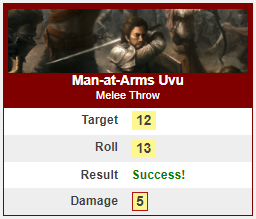

# Roll20 Character Sheet for Autarch ACKS
This is a Roll20 specific character sheet designed for use with the Adventurer Conqueror King System (ACKS) OSR RGP, published under the OGL 1.0 license, by Autarch.

Hopefully, this documentation below comes in useful. I know I've struggled over the years when attempting to implement custom character sheets. Even the official sheets are sometimes difficult to divine.

---

## Version 3.0
This is v3 of the character sheet, for supporting ACKS II.

The main differences between v1 and v2 was that I removed any/all SRD class-specific information from the sheet. I did this because, after a thorough review of just about all ACKS content I could find, it became clear that embedding this information was a fool's errand. It streamlined a lot of work when generating and using ACKS-specific classes, but also became un-maintainable. If you've been using the sheet and enjoiying this feature, my apoligies, but I couldn't maintain it.

Additionally, I removed any spellcasting modifications beyond ACKS Core and Player's Companion; specifically Cantrips support and Shades of Magic. The further into ACKS Heroic Fantasy Handbook I delved, the more it became clear that the two magic systems (Core vs. HFH) are really not compatible without extensive sheet customizations to account for spellsinging and ceremonial magic. For now, this sheet sticks to non-HFH with the following exceptions, all of which can be ignored if desired:

 - A BHR button exists to roll BHR, based on the character's max hit points
 - Natural 20 combat rolls explode (to determine crits as per HFH)
 - Fate points can be tracked

 Finally, all conditions controls were removed. Playtesting demonstrated that embedding conditions into the character sheet just over-complicated the process of tracking and applying condition modifiers throughout. Conditions should now be tracked using token icons and their impacts applied to rolls through the global Modifiers prompt.

---

## Installing
To use this sheet in your own games:

1. In Roll 20, click *Create New Game* and select *Custom* from the *Optional: Choose Character Sheet* drop-down menu.
2. Once the game is created, go to *Settings* > *Game Settings*.
3. Under *Character Sheet Template*...
    1. Within the *HTML Layout* tab, paste in the contents of charactersheet.html.
    2. Within the *CSS Styiling* tab, paste in the contents of charactersheet.css.
    3. Ensure that *Legacy Sanitation* is **NOT** checked.
4. Save your changes and launch the game.

**This sheet does not yet support translation.**

---

## Tabs
The sheet is divided into tabs to help isolate different bodies of information and simplify usage:

| Tab Title | Description |
| --- | ---|
| *Overview*     | The characters attributes, saves, key characteristics, names, and a summary of important combat stats and conditions. |
| *Class* | Class-specific information, such as class-specific global combat modifiers, spellcasting, and thieivng abilities. If the class in question doesn't require some (or any) of these, leave them alone. |
| *Skills* | The first section is for custom abilities, such as *Find Secret Door* and *Hear Noise*. The second is for listing proficiencies. Each section provides a throw and a description button (see below). |
| *Combat* | Contains buttons for initiative, surprise, etc., armor configuration, attack throw and type, melee attacks, missile attacks, and critical effects generators. |
| *Equipment* | Lists all equipment, calculates encumbrance and speed, currency (on hand, banked, and found recently), and standard of living and other monthly costs. |
| *Hirelings* | Used for tracking henchmen, mercenaires, and specialists in the employ of the character. |
| *Journal* | Tracks character background, appearance, languages, injuries. additional properties/debts, adventuring notes, and experience gains. |
| *Settings* | Use these settings to alter base movement/encumbrance functionality for non-humanoid creatures, such as horses, mules, etc. |

---

## Overview Tab

| Property | Description |
| --- | --- |
| *character_fullname* | Provided to allow for more 'expressive' and complete names than either the standard *character_name* or *token_name* properties. |
| *class* | As a text field, allows for any class name desired. |
| *character_title* | As a text field, allows for any title name desired. |
| *experience* | Auto calculated based on entries made to the Journal tab. Also, automatically applies the character's XP bonus from attribute prerequisites. |
| *level* | Minimum value allowed is 0; maximum is 14. Currently, the sheet doesn't limit level based on class. |
| attributes | Minimum value for each is 0; maximum is 20. Use/edit the 'Nominal' column to track (and preserve) the character's un-modified scores. This is done via the Roll20 character sheet 'Attributes & Abilities' tab by inputing 'Max' values for each attribute. Click the 'Prereq' checkbox(es) to auto-calculate the character's XP bonus, shown next to the 'Experience' field label, above. |
| saving throws | Use the modifier fields as needed. Save values are automatically set if the Monster Stats > Save field is popoulated (e.g. 'F3'). This feature can also be used to auto-update save targets for most player classes. |
| monster stats | These fields are intended for use with monster sheets. |

---

## Class Tab

| Property | Description |
| --- | --- |
| class bonuses | These fields are intended to capture *global* bonuses specific to the *class* selection. Class abilities that provide one or more of these bonuses but only under certain conditions should **not** be tracked here. Note that *class_damage_reduction* must be applied manually at the time of the damage roll. |
| spell slots | These can be used for any spellcasting class. |
| spell list | These should be self-explanatory. Use the Prepared checkbox to indicate if a spell is in the characater's repertoire or not (in a spellbook). |
| thieving abilities | These buttons' throw targets are set manually. Leaving them empty will not produice a roll result. |

---

## Skills Tab

| Property | Description |
| --- | --- |
| abilities | This repeating section is intended for use to track various additional skills that a character may possess, not explicitly captured on the sheet elsewhere. |
| *ability_source* | Used to indicate where the ability is derived from. I use 'common' to indicate an ability that all characters have, 'class' for additional class-specific abilities, 'proficiency' if derived from an ACKS proficiency, etc. |
| *ability_target* | Sets the throw target for the ability. The Throw button supports the use of optional sheet attritbutes so more complex auto-calculations can be performed here. For example, '14 - (@{level}-1) * 2', to set the initial target to 18 and subract 2 for every additional character level over 1. |
| proficiencies | Use this repeating section to track a character's ACKS proficiencies. |
| *proficiency_target* | Sets the throw target for the proficiency. Supports the use of skill attribute formulas, as per *ability_target*, above. However, *proficiency_rank* modifiers are already factored into the throw and don't need to be accounted for here. |

---

## Combat Tab

| Property | Description |
| --- | --- |
| *roll_initiative* | When the button is clicked, accepts a modifier and then applies it to a 1d6 roll, modified by *mod_initiative* field value if any. The number is then multiplied by 100 and a d99 added, in order to break down simultaneous actions more finely, if desired (if not, simply ignore the last two digits in the result.) The result is output in the Roll20 chat window and sent to the turn tracker. Use the modifier field to account for two-handed weapon penalties and/or other necessary modifications to the roll, as needed. |
| *roll_surprise* | When the button is clicked, accepts a modifier and then applies it to a 1d6 roll, modified by *mod_surprise* field value if any. A result of 1 or 2 results in 'surprised'; otheriwse 'ready', as per ACKS Core pg. 97. The result is output in the Roll20 chat window. |
| *roll_reaction* | When the button is clicked, accepts a modifier and then applies it to a 2d6 roll, modified by *mod_reaction* field value if any. The result is sent to the Roll20 chat window and includes a short-hand table to explain the result, as per ACKS Core pg. 99. |
| *roll_morale* | Intended for use with non-PC characters, when the button is clicked, accepts a modifier and then applies it to a 2d6 roll, modified by *mod_morale* field value if any. The result is sent to the Roll20 chat window and includes a short-hand table to explain the result, as per ACKS Core pg. 110. |
| *armor_class* | This value is determine by selecting the appriopriate armor from the drop-down list, providing a bonus if necessary (e.g. magical armor, or a monster's natural AC), checking the Shield checkbox if wielded, and then accounting for DEX bonus. This value may also be auto-adjusted based on current, applicable conditions (see Overview tab). |
| *has_helm* | If checked, activates heavy helm penalties and bonuses described in the ACKS Player's Companion sourcebook. |
| effects generators | See Roll Templates, below. |
| *attack_throw* | The value is used as the base target for all melee and missile throws. |
| *num_attacks* | This is a text field used mainly to track monster attack patterns (e.g. 'claw/claw/bite, or breath'). Its default value is '1 (by weapon)' and isn't used anywhere else on the sheet. |
| melee attacks | A repeating list to track a creature's hand-to-hand attacks. Use different melee attack entries to track one- vs. two-handed usage/damage for applicable weapons. |
| *melee_is_equipped* | Indicates that the weapon is currently equipped. |
| *melee_reach* | The weapon's reach, in feet. The default is 5. Not used elsewhere in the sheet - its only a visual reminder for the player. |
| *melee_throw* | When a throw is made, the user will be prompted for the target's AC, to select their fighting style (either 'Normal', 'Dual-Wield', or 'Finesse'), and provide any additional modifier. Note that the character's str and/or dex is included in the fighting style calculation. The throw supports Exploding 20s to determine citical hits from ACKS HF pg. 85. |
| *melee_is_twohanded* | Indicates that the weapon is exclusively used two-handed. If *melee_is_equipped* is also checked, triggers the ACKS -1 penalty to initiative rolls. |
| *melee_bonus* | Applies to attack throws, but not damage. |
| *melee_damage* | Use 'xdy+z' format. |
| missile attacks | A repeating list of a creature's missile attacks; the same as for melee attacks, above. Note that ammo consumption is not currently tracked/modified automatically. |
| *missile_is_equipped* | Indicates that the weapon is currently equipped. |
| *missile_range* | A text field to track a missile attack's range bands. For example, '10/20/30'. It is not used anywhere else in the sheet. |
| *melee_damage* | Use 'xdy+z' format. |
| *missile_ammo* | Two fields (optional). Used to keep track of ammo (*not* tracked under equipment). Use the hidden field to track total ammo on-hand prior to combat, and the unhidden field to track ammo remaining after making attacks. Before battle, the two fields should have the same value. After battle, compute the difference and allow the character to retrieve half of their fired ammo. |

### A note concerning melee weapons and thier attacks
This sheet was designed to accomodate the various ways in which ACKS allows characters to use different types of weapons in different modes of attacks, as follows:

- Change the *melee_reach* value, as appropriate. For example, a spear has a reach of 10.
- Check *melee_is_twohanded* checkbox to indicate that the weapon is exclusively for 2-handed use (and imparts a -1 initiative penalty).
- For weapons that may be used as one- or two-handed, create two melee attack entries. For example, 'Spear' for 1d6 damage and 'Spear (Two-Handed) for 1d8 damage.
- By default, anything can be thrown as 'Improvised' for 1d3 damage at 10/20/30 ranges (house rules); see ACKS pg. 103 for list of specialized throwing weapons and their ranges. These weapons should also have a dedicated missile attack line-item. For example, 'Spear (Thrown)' for 1d6 damage.
- Check appropriate *melee_is_equipped* or *missile_is_equipped* checkboxes to indicate the character's current weapons configuration. For example, there would be three equipped weapon attacks for a spear; melee:'Spear', melee:'Spear (Two-Handed)', and missile:'Spear (Thrown)'. Neither melee attack would be checked as *melee_is_twohanded*, because a spear is not exclusively a two-handed weapon.
- Finally, note that dual-wielding and/or Weapon FInnesse proficiency is a choice made during a melee strike, not melee configurations per se. These options are captured during each combat roll (Style = Normal|Dual|Finesse). Normal is the default.

---

## Equipment Tab

| Property | Description |
| --- | --- |
| *enc_capacity* | This value is automatically determined as per ACKS Core pg. 48. |
| *encumbrance* | This value is automatically determined as per ACKS Core pg. 48, based on the character's inventory (see below). |
| *move_turn* | This value is automatically determined as per ACKS Core pg. 48. The base movement is assumed to be 120 feet per turn. This value can be modified using the Overview > Conditions > Movement field. |
| *move_round* | *move_turn* divided by 3. |
| equipment | A repeating list of all gear the character possesses. |
| *item_weight* | Set this value equal to 0.17 for small items or bundles (ammo), or use smaller values for items like individual arrows, gems, holy symbols, etc. Include armor and weapons as well, as per ACKS Core pg. 48. |
| *item_value* | An optional field used to track an item's value, in gold pieces. It is not used any place else on the sheet. |
| *item_equipped* | A checkbox to indicate if the item(s) is being carried. If not, its weight is not factored into *encumbrance*. |
| Currency | Fields for tracking coins carried, banked (not carried), and new (and carried) but not yet claimed by the player. Use the new field to add/subtract coinage on behalf of the player, then ask them to "accept" the change by clicking the Claim button. The table includes a handy conversion rate for each coin type. |
| Monthly Budget | Subtracts the monthly Cost of Living for the selected *living_standard* and any applicable monthly hireling fees. Adds any applicable monthly fees from professional Professions. |

### Author's Note Regarding Equipment Assumptions
- I recommend tracking rations by day, instead of by week, with each day's rations weighing 0.17 stone. 
- I also simplify water by inventorying a single water skin, weighing 1 stone. If the characters are *not* in a dungeon, desert, or other locale where water isn't readily available at the end of the day, mark the skin as not equipped and observe penalties for thirst. My equipment script, described below, makes these assumptions. 
- Every 20 rounds of ammo counts as one container, weighing 0.17 stone. For example, a quiver may contain up to 20 arrows (tracked on Combat tab > Missile Attacks) for a fixed weight of 0.17 stone.

---

## Hirelings Tab

| Property | Description |
| --- | --- |
| *hireling_fees* | A caluclated value based on the contents of the following repeating lists. |
| Henchmen | Specify Name, Class, Level, Take (%), and Morale Bonus (if any). Enter additional Notes. *henchman_fee* is auto-set based on *henchman_level*. All other stats for each henchman should be tracked in a seperate NPC character sheet. Use the Morale Check button to check each henchman's morale, as needed. |
| Mercenaries | Specify Type, Quantity, Monthly Fee, and Morale Bonus. Enter additional Notes. *merc_fee* is multiplied by *mer_number* automatically. Use the Morale Check button to check each henchman's morale, as needed. |
| Specialists | Specify Occuptation and Monthly Fee. Enter additional Notes.

---

## Journal Tab
This tab contains text area fields for tracking additional character information, including:

* Background
* Appearance
* Languages spoken
* Injuries sustained (and their effects)
* Property & Debt
* Adventuring Notes
* Experience Gained

Add a new Experience Gained record to the repeating list each time the character returns to civilization and XP is calculated. This should include both monster and treasure XP, as well as any additional XP for decision-making, role-play, etc. Use the Date field to indicate the real date the character received the XP. The character's total XP (read-only) is calculated based on these entries.

---

## Settings
This tab contains base values used in making encumbrance and movement calculations. These values should only be changed when using the sheet to represent non-humanoid NPCs, such as mounts, draft animals, etc.

| Property | Description |
| --- | --- |
| Max Encumbrance | Change to set the maximum limit that the creature can carry. Is modified by *str_mod*. |
| Enc Threshold X | Change to alter the encumbrance threshold at which point max movement rate is divided by 3/4, 1/2, or 1/4. The ACKS humanoid defaults are 5, 7, and 10 stone, respectively. Thresholds should never be descending in value, but can be the same value. The latest value to exceed the current capacity is the threshold that will be used. For example, a mule would use 20, 20, and 40; a 20 encumbrance would only trigger 1/2 movement, never 3/4. |
| Max Movement | Change to set the maximum movement value for the creature. The default is 120' per turn. |

---

## Roll Templates

### 'Custom' Template
The ACKS sheet leverages a custom roll template that supports the following properties:

- *title*: the title to be displayed
- *subtitle*: an optional subtitle to be displayed
- *color*: the default header color is gray, but additional colors may be specified: blakc, brown, blue, gold, green, orange, and red
- *effects*: an optional effects field, used to provide flavor
- *desc*: an optional description field, used to provide details
- *roll* plus *target*: if roll is **less** than target, will indicate *success*; otheriwse, *failure*
- Support for Combat > *roll_surprise* outcomes (see above)
- Any additional parameters via the *allprops* roll template feature

### 'Custom' Template Banners
The roll template supports the use of an image banner in its header. However, to respect artist intellectual property, these are not included in the sheet by default. You will need to supply such banners yourself, if desired. The list of template headers that can be customized can be found at the end of the sheet HTML just before the sheet worker section. Hopefully, the *name* properties (SOMECONTEXT, below) are intuitive.

Use the following syntax to embed your own banner header graphics:

> \<input type='hidden' name='attr_banner_SOMECONTEXT' value='\[x](BANNERURL#.png)'/>

If the banners are located in your Roll20 library, you can obtain its *Banner_URL* by dragging it to any Roll20 page, selecting it, and pressing SHFT+Z to display it in the Roll20 image modal view. Then, right click the image and choose *Copy image address*. Replace the *BANNERURL* portion, abover, with the copied URL (keep the '\[x]', the parentheses, and the '#.png').

I recommend that banners be 300px-by-80px and PNG format.

### Other Templates
The sheet uses additional roll templates to provide results when rolling on the Combat > Effects Generators for critical hits (character or monster) as per ACKS HF pg. 85.

---

## Supporting Macros
The following macros can be found in the /macros sub-directory of the git. They are *highly* recommended:

* **actions**: uses the Roll20 [ChatMenu](https://app.roll20.net/forum/post/7474530/script-call-for-testers-universal-chat-menus/?pagenum=1) API script to whisper a list of nearly all sheet buttons into the Roll20 chat. Buttons are organzied by type: Combat Rolls, Attack Throws (only if *melee_wielded* and *missile_wielded* are checked), Skill & Proficiency Throws, Attribute Throws, and Saving Throws. This script saves the players a **lot** of time and is highly recommended. Specify 'Show as Token Action' to apply the macro to every sheet token. Select the token, and then click the macro to use it.
* **conditions**: uses the Roll20 [TokenMod] API add-on to apply/remove ACKS condition token icons with a click of a button. Note that my version relies on additional, custom icons that I created and imported into the game, but the script can be modified to use only the stock icons, as desired.
* **repertoire**: also uses ChatMenu API script to output the character's repertoire (*spell_prepared* checkbox = on) to the Roll20 chat as clickable links. This macro should be added to specific character sheets via the Roll20 Attributes & Abilities tab.
* **spellbook**: same as for repertoire, above, but outputs a list of all spells in the character's spell list, regardless of *spell_prepared* status.

---

## Supporting API Scripts
The following scripts can be found in the /scripts directory of the git. They are also *highly* recommended:

* **AddDefaults** : Invoked by selecting one or more tokens on the map and then typing '!AddDefaults' in the Roll20 chat window. This will add 'generic' melee and missile attacks to each selected tokens' character sheet > Combat > Melee/Missile Attacks repeating lists. For example, Punch, Kick, Improvised, etc.

* **AddSkills**: Invoked by selecting one or more tokens on the map and then typing '!AddSkills' in the Roll20 chat window. This will add common ACKS abilities to each selected tokens' character sheet > Skills > Abilities repeating list. For example, Find Secret Doors, Hear Noise, etc.

### Author's Note
These scripts were derived from the same source found in the Roll20 forums. I did not author this script and do not recall who on the forums did. If anyone knows, please contact me so I can provide the proper credit.

---

## Built With

* [Roll20](https://roll20.net/)
* [VS Code](https://code.visualstudio.com/)
* [CSS Grid](https://css-tricks.com/snippets/css/complete-guide-grid/)

---

## Authors

* **omonubi** - *Initial work* - [omonubi.com](https://www.omonubi.com)

---

## License

This project is currently not licensed in the git.

The ACKS intellectual property contained within the character sheet is covered under the [OGL 1.0 License](OGL.md) and used with full permission of Alexander Macris, Autuarch.

---

## Acknowledgments

* Alexander Macris, author of ACKS and owner of Autarch
* GiGs, TheAaron, Kraynic, and everyone else in the [Roll20 Forums](https://app.roll20.net/forum/) that have helped me progress to where I am in sheet development over the years.
* My Wednesday night ACKS gaming group, who have put up with me for far too long. ;)
